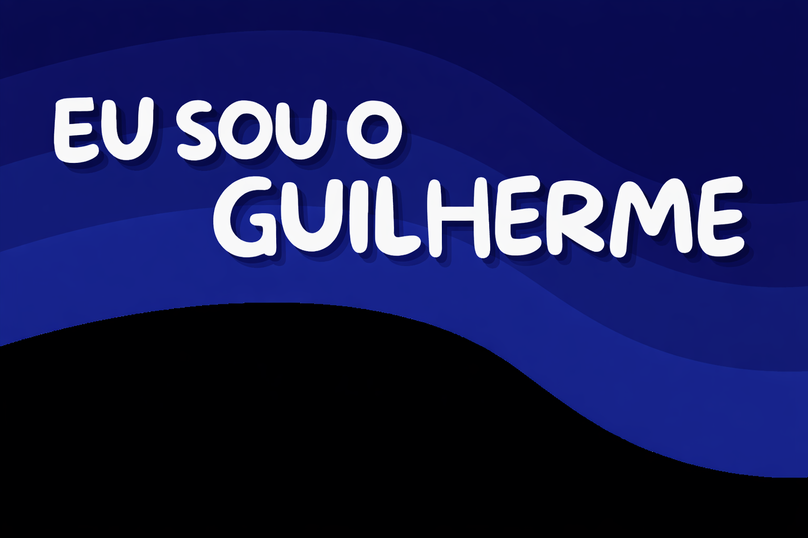

  Um desenvolvedor apaixonado do Brasil 
  Sou formado em Sistemas de Informação pela UGB-FERP (Volta Redonda–RJ), apaixonado por programação e tecnologia.

<h2 align="center">🚀 Languages and Tools I Use</h2>

  
  &nbsp;&nbsp;
  
  &nbsp;&nbsp;
  
  &nbsp;&nbsp;
  
  &nbsp;&nbsp;
  

<h2 align="center">🔗 Where to find me</h2>

  
  &nbsp;&nbsp;
  
  &nbsp;&nbsp;
  

